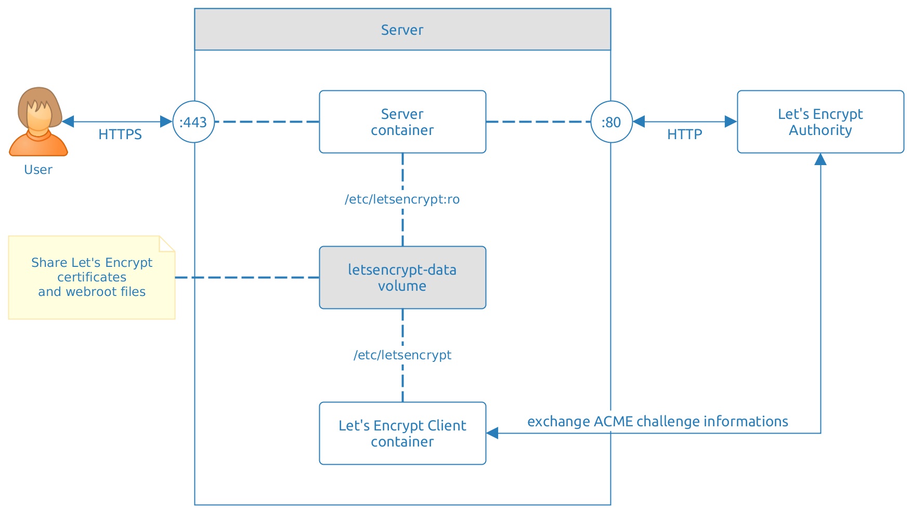

# Let's Encrypt Docker Webroot Client with Auto-Renewal

This Docker image allows one to fetch an SSL certificate from the Let's Encrypt authority.

This project focuses on the easiness of integration.

This repository extends the **official** Let's Encrypt Docker image on [quay.io](https://quay.io/repository/letsencrypt/letsencrypt). This project adds only the auto-renewal functionality and integration examples on top.

## Requirements

- [Docker Engine](https://docs.docker.com/engine/installation/)
- web server with [`webroot` access](#server-requirements)
- [Systemd](https://www.freedesktop.org/wiki/Software/systemd/) - optional - see [example below](#systemd-installation)

## Overview



Files are shared between "Let's Encrypt client container" and the webserver through the `letsencrypt-data` volume. Find their description below:

- `/etc/letsencrypt/cli.ini` - main Let's Encrypt configuration file

  File can be shared with the "Let's Encrypt client container" or will be created automatically if `$DOMAINS` and `$EMAIL` environment variables are set.

- `/etc/letsencrypt/webroot/` - directory which **must be shared** with the **web server**

  Let's Encrypt client will create the ACME challenge file in the following directory:

  ```
  /etc/letsencrypt/webroot/.well-known/acme-challenge/
  ```

- other directories created by the Let's Encrypt client:

  `accounts`, `archive`, `csr`, `keys`, `live`, `renewal`


## How to use this project?

### Server Requirements

The web server **must** have **access** to the `letsencrypt-data:/etc/letsencrypt/webroot` volume directory.

Web server example:

```
docker run -d --name proxy \
           --volume=/home/core/configuration/nginx.conf:/etc/nginx/nginx.conf:ro \
           --volume=letsencrypt-data:/etc/letsencrypt:ro \
           -p 80:80 -p 443:443 \
           nginx:latest
```

Make the `/etc/letsencrypt/webroot` directory available to the Let's Encrypt authority. Let's Encrypt will do requests to your domains, similar to the one presented below:

```
GET /.well-known/acme-challenge/...
```

### Standalone Installation

- create volume container which stores the data:

  ```
  docker volume create --name=letsencrypt-data
  ```

- create Let's Encrypt client container

  ```
  docker run -it \
             --volume=letsencrypt-data:/etc/letsencrypt \
             --volume=/host/path/to/cli.ini:/etc/letsencrypt/cli.ini:ro \
             czerasz/letsencrypt-acme-autorenew:latest
  ```

  Where `/host/path/to/cli.ini` is the path to the main Let's Encrypt configuration file on the server.

  or

  ```
  docker run -it \
             --volume=letsencrypt-data:/etc/letsencrypt \
             --env='DOMAINS=example.com,www.example.com' \
             --env='EMAIL=contact@example.com' \
             czerasz/letsencrypt-acme-autorenew:latest
  ```
